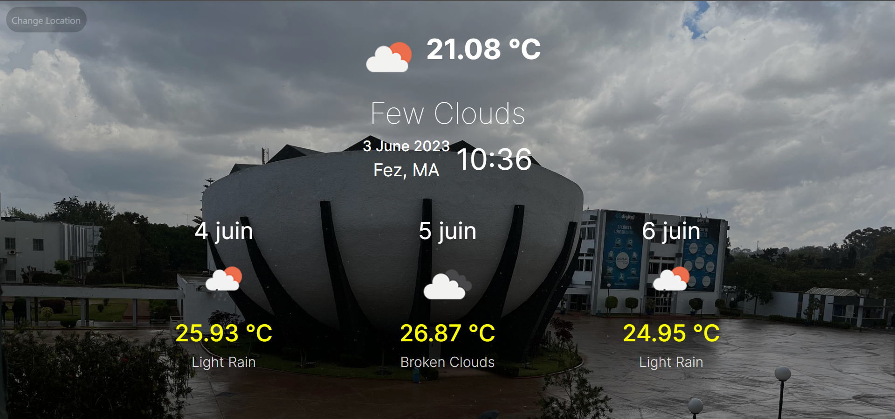

# WeatherThen

WeatherThen une application météorologique interactive qui permet aux utilisateurs de consulter facilement les prévisions météorologiques pour leur région. L'application offre une interface conviviale et propose des fonctionnalités telles que l'affichage des prévisions actuelles, les prévisions à court terme et la personnalisation des unités de température.

Vous pouvez consulter une démo en ligne à l'aide de ce lien: [démo en ligne](https://weatherthen.netlify.app/)

## Documentation

- [Rapport de projet](doc/Rapport.pdf) - Consultez le rapport de projet détaillé pour en savoir plus sur les objectifs, les réalisations et les perspectives d'avenir du projet WeatherThen.
- [User Stories](doc/UserStories.pdf) - Découvrez les histoires utilisateur qui décrivent les fonctionnalités clés de l'application WeatherThen.
- [Cahier des charges](doc/CdC.pdf) - Consultez le document de spécifications pour obtenir des informations détaillées sur les fonctionnalités, les contraintes et les exigences techniques du projet.

## Installation

1. Assurez-vous d'avoir Node.js installé sur votre machine.
2. Clonez ce dépôt à l'aide de la commande suivante : `git clone https://github.com/votre_utilisateur/WeatherThen.git`
3. Accédez au répertoire du projet : `cd WeatherThen`
4. Installez les dépendances : `npm install`

## Utilisation

1. Démarrez l'application en utilisant la commande suivante :`npm start`
2. Accédez à l'application dans votre navigateur en visitant l'URL suivante : `http://localhost:3000`

*Ou*

Vous pouvez consulter une démo en ligne à l'aide de ce lien: [démo en ligne](https://weatherthen.netlify.app/)

## Contribuer

Les contributions sont les bienvenues ! Si vous souhaitez contribuer à l'amélioration de WeatherThen, veuillez suivre les étapes suivantes :

1. Fork ce dépôt.
2. Créez une branche pour vos modifications :`git checkout -b ameliorations`
3. Effectuez les modifications souhaitées et committez-les :`git commit -m "Ajouter des améliorations"`
4. Poussez vos modifications vers votre dépôt :`git push origin ameliorations`
5. Ouvrez une demande d'extraction (Pull Request) pour que nous puissions examiner vos modifications.

## Auteurs

- Muhammad AIT MOUHI
- Oussama ELKIHEL
- EL-houcine Meziani

## Licence

Ce projet est sous licence [MIT](LICENSE).
